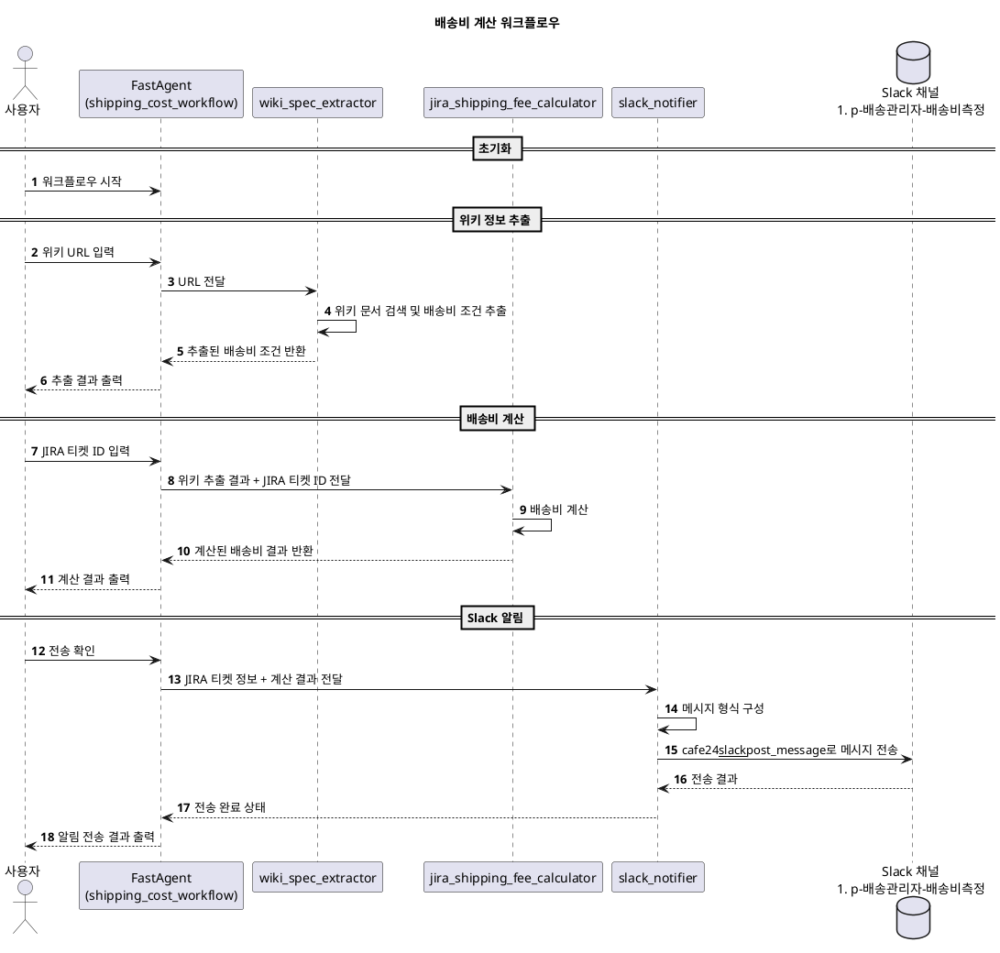

# 배송비계산_[배송관리자] FAST-AGENT 활용

## 과제
G2G 활용을 위해 글로벌 전용 멀티샵의 배송비 계산을 앱에서 직접 처리하도록 배송관리자 서비스를 복원하고 있습니다.  
기존 배송관리자 프로젝트를 재검토하고 있지만, 배송비 측정 기준이 복잡하여 업무 진행에 시간이 소요되고 있습니다.  
이에 Fast Agent와 MCP를 활용해 지라에 입력된 상품의 무게, 수량, 가격 정보를 기반으로 위키 사양에 따라 배송비를 자동 측정한 후 결과를 Slack 메시지로 즉시 안내하여 개발자, 기획자, QA의 업무 효율을 높이고자 합니다.

## FastAgent 개념
관련 링크
- https://github.com/evalstate/fast-agent
- https://fast-agent.ai/

### FastAgent 개념
```python
@fast.chain(
  name="post_writer",
  sequence=["url_fetcher", "social_media"],
)
async def main():
    async with fast.run() as agent:
        await agent.post_writer("http://llmindset.co.uk")
```

- **Parallel (병렬) 워크플로우**  
동일한 메시지를 여러 에이전트에 동시에 보내고, 각각의 결과를 합치는 방식입니다. 이는 예를 들어 다른 언어로 번역하는 작업을 동시에 진행할 때 유용합니다.

- **Evaluator-Optimizer (평가자-최적화자)**  
생성자 에이전트가 콘텐츠를 생산하면, 평가자 에이전트가 결과를 검토하고 피드백을 제공하여 내용을 개선합니다. 이 과정을 반복하여 최종 출력물을 도출합니다.

- **Router (라우터)와 Orchestrator (오케스트레이터)**  
라우터는 입력 메시지를 분석하여 가장 적합한 에이전트로 라우팅하며, 오케스트레이터는 복잡한 작업을 분할 계획을 세워 여러 에이전트에게 할당합니다.

이러한 다양한 워크플로우 구조를 통해 에이전트 간의 조합과 협업을 극대화할 수 있습니다.

### 멀티모달 및 리소스 지원
- **이미지 및 PDF 지원**  
fast-agent는 단순 텍스트 입력/출력 뿐만 아니라 이미지와 PDF와 같은 멀티모달 리소스도 처리할 수 있습니다. 프롬프트에 리소스를 첨부하거나, MCP 타입을 활용하여 에이전트가 이를 활용하도록 할 수 있습니다.

- **MCP Tool Result Conversion**  
LLM API의 제한 때문에, 에이전트가 반환하는 툴 호출 결과는 텍스트나 이미지로 변환되어 채팅 대화에 추가됩니다. 이는 OpenAI와 Anthropic 모두 지원합니다.

### 샘플 코드와 모델 선택
- **샘플 에이전트 예제**  
GitHub에 포함된 예제들에서는 기본적인 'sizer' 에이전트부터 URL 요약, 소셜 미디어 포스트 생성, 연구자 에이전트 등 다양한 예제가 제공됩니다.

- **모델 선택 기능**  
간단한 명령행 스위치(`--model`)를 통해 모델을 지정할 수 있습니다. 예를 들어, `uv run sizer.py --model o3-mini.low`처럼 실행하면 지정된 모델에 맞게 에이전트가 작동합니다.

### 기타 주요 기능
- **Human Input 지원**  
에이전트가 실행 도중에 추가적인 사용자 입력을 요청할 수 있습니다. 이는 복잡한 문제 해결이나 맥락이 필요한 작업에서 유용하게 사용됩니다.

- **프롬프트 및 데코레이터 기반의 구성**  
에이전트나 워크플로우의 기본 지침(인스트럭션)은 데코레이터를 통해 정의되며, 이로 인해 기존의 복잡한 설정 없이도 에이전트의 역할과 기능을 쉽게 지정할 수 있습니다.

- **설정 파일 기반의 구성**  
모든 에이전트와 워크플로우는 간단한 구성 파일(예, `fastagent.config.yaml`, `fastagent.jsonl`)을 통해 버전 관리와 관리가 용이하도록 되어 있습니다.

- **빠른 프로토타이핑 및 테스트**  
인터랙티브 셸을 제공하여 개발자는 에이전트를 실행하고, 각 단계를 미리 확인하며 조정할 수 있습니다.

- **MCP Native 지원**  
fast-agent는 최신 MCP 기능을 네이티브로 지원하며, 앞으로도 더 많은 예제와 문서가 추가될 예정입니다.

### 프로젝트 배경 및 기여
- **프로젝트 계보**  
이 프로젝트는 Sarmad Qadri가 진행한 `mcp-agent` 프로젝트를 기반으로 하며, 그 위에 다양한 기능들을 확장해 나가고 있습니다.

- **오픈 소스와 커뮤니티 기여**  
Apache-2.0 라이선스로 공개되어 있으며, GitHub를 통해 누구나 기여할 수 있습니다. 현재 777개의 스타와 62개의 포크를 기록하며 활발히 유지보수 및 발전되고 있습니다.

### 결론
`fast-agent`는 LLM 기반의 에이전트와 복잡한 워크플로우를 간단한 구성 파일과 데코레이터를 이용해 빠르게 개발하고 테스트할 수 있는 강력한 프레임워크입니다.

다중 모달 지원, 다양한 워크플로우 구조, 인터랙티브 셸 등 여러 기능을 제공하여 AI 애플리케이션 개발에 있어 유연성과 확장성을 동시에 추구합니다.

위 내용은 GitHub의 [fast-agent](https://github.com/evalstate/fast-agent) 저장소의 README 문서를 토대로 정리한 설명입니다.

## 설정

### fastagent.secrets.yaml
- API 키 등 민감한 정보를 안전하게 관리하는 파일
```yaml
openai:
   api_key: {팀장님 문의}
anthropic:
   api_key: {https://console.anthropic.com/settings/keys > create key}
```

### fastagent.config.yaml
- 에이전트 및 MCP 서버 등 전체 워크플로우 구성을 정의하는 설정 파일
```yaml
# MCP Servers
mcp:
    servers:
        fetch:
            command: "uvx"
            args: ["mcp-server-fetch"]
        filesystem:
            command: "npx"
            args: ["-y", "@modelcontextprotocol/server-filesystem", "."]
        cafe24mcp:
            transport: "sse"
            url: "https://mcp-hub.hanpda.com/sse?token={https://mcp-hub-front.hanpda.com/ 참고}"
            read_timeout_seconds: 10
```

## 흐름도



## 코드
```python
import asyncio
from mcp_agent.core.fastagent import FastAgent

# 전체 워크플로우 이름 지정
fast = FastAgent(name="shipping_cost_workflow")

# 기본 공통 에이전트 설정
@fast.agent(instruction="You are a helpful AI Agent", servers=["fetch"])

# 1. 위키 문서 검색 및 배송비 조건 추출 에이전트
@fast.agent(
    "wiki_spec_extractor",
    "당신은 위키문서 검색 전문가입니다. 위키 URL을 입력해 주세요. 해당 URL의 문서를 MCP를 통해 검색하여, 기획서 내 배송비 산출에 필요한 주요 조건(예: 배송 방식, 상품 무게, 거리 등)을 추출하십시오.",
    servers=["cafe24mcp"],
)

# 2. JIRA 티켓 기반 배송비 계산 에이전트
@fast.agent(
    "jira_shipping_fee_calculator",
    (
        "당신은 JIRA 배송비 측정 전문가입니다.\n"
        "입력으로는 위키 결과와 추가로 JIRA 티켓 ID가 제공됩니다.\n"
        "제공된 정보를 바탕으로 배송비를 계산하고, 관련 정보를 출력하십시오."
    ),
    servers=["cafe24mcp"],
)

# 3. Slack 알림 에이전트 (JIRA 코멘트 대신)
@fast.agent(
    "slack_notifier",
    (
        "당신은 Slack 메시지 전문가입니다.\n"
        "입력으로 JIRA 티켓 ID와 계산된 배송비 결과가 제공됩니다.\n"
        "C08MJ6KNBFT 채널에 JIRA 티켓 URL과 계산된 배송비 정보를 포함한 메시지를 작성해 주십시오.\n"
        "메시지는 cafe24__slack__post_message 도구를 사용하여 전송하세요."
    ),
    servers=["cafe24mcp"],
)

async def main():
    async with fast.run() as agent:
        # 1단계: wiki_spec_extractor 에이전트 실행
        wiki_url = input("1) 위키 URL을 입력해 주세요: ")
        wiki_result = await agent.wiki_spec_extractor.send(wiki_url)
        print("\n[wiki_spec_extractor 결과]")
        print(wiki_result, "\n")
        
        # 2단계: jira_shipping_fee_calculator 에이전트 실행
        jira_ticket = input("2) 배송비 계산을 위한 JIRA 티켓 ID를 입력해 주세요: ")
        calculator_input = f"Wiki 결과: {wiki_result}\nJIRA 티켓 ID: {jira_ticket}"
        calculator_result = await agent.jira_shipping_fee_calculator.send(calculator_input)
        print("\n[jira_shipping_fee_calculator 결과]")
        print(calculator_result, "\n")
        
        # 3단계: Slack 알림 전송
        input("3) 계산 결과를 #**p-배송관리자-배송비측정**에 전송하려면 엔터 키를 누르세요...")
        # JIRA 티켓 URL 형식은 회사마다 다를 수 있으므로 예시 형식을 사용합니다
        jira_url = f"https://jira.cafe24.com/browse/{jira_ticket}"  # 예시 URL 형식
        slack_input = f"JIRA 티켓 ID: {jira_ticket}\nJIRA URL: {jira_url}\n계산 결과: {calculator_result}"
        slack_result = await agent.slack_notifier.send(slack_input)
        print("\n[slack_notifier 결과]")
        print(slack_result)
        
if __name__ == "__main__":
    asyncio.run(main())
```

## 결과

| agent | 단계 | 결과 |
|-------|------|------|
| wiki_spec_extractor | 위키 URL 입력 | [이미지: 위키 URL 입력 화면] |
|  | 위키 검색 결과 반환 | [이미지: 위키 검색 결과 화면] |
| jira_shipping_fee_calculator | JIRA 티켓 ID 입력 | [이미지: JIRA 티켓 ID 입력 화면] [이미지: 입력 확인 화면] |
|  | 위키 추출 결과 + JIRA 티켓 ID 전달 | [이미지: 추출 결과와 티켓 ID 전달 화면] |
|  | 배송비 계산 & 계산된 배송비 결과 반환 | [이미지: 배송비 계산 결과 화면] |
| slack_notifier | 메시지 형식 구성 및 cafe24__slack__post_message로 메시지 전송 | [이미지: 메시지 구성 및 전송 화면] |
|  | 전송 결과 | [이미지: Slack에 전송된 결과 화면] |

위 테이블은 실제 위키 페이지에서는 각 단계별로 스크린샷 이미지가 포함되어 있습니다. 실제 실행 결과에서는:

1. 위키 URL 입력 화면과 추출된 배송비 조건 정보가 표시됩니다.
2. JIRA 티켓 ID 입력 화면과 해당 티켓의 상품 정보를 바탕으로 계산된 배송비 결과가 표시됩니다.
3. 계산된 결과를 Slack 채널에 전송하는 과정과 실제 Slack에 전송된 메시지 화면이 표시됩니다.

각 단계마다 실제 작동하는 모습을 스크린샷으로 제공하여 워크플로우의 실제 동작을 시각적으로 확인할 수 있게 되어 있습니다.
